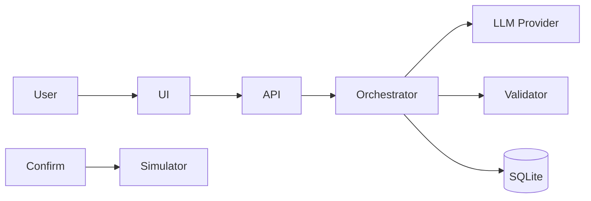

# Architecture

```mermaid
flowchart LR
  User --> UI
  UI --> API
  API --> Orchestrator
  Orchestrator --> Mock[LLM Provider]
  Orchestrator --> Validator
  Orchestrator --> Store[(SQLite)]
  Confirm --> Simulator
```

Trust boundaries: the validator and human confirmation gate all execution.
